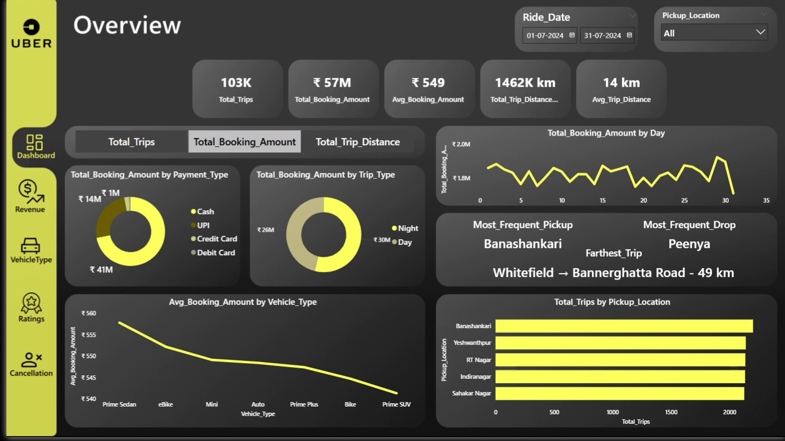
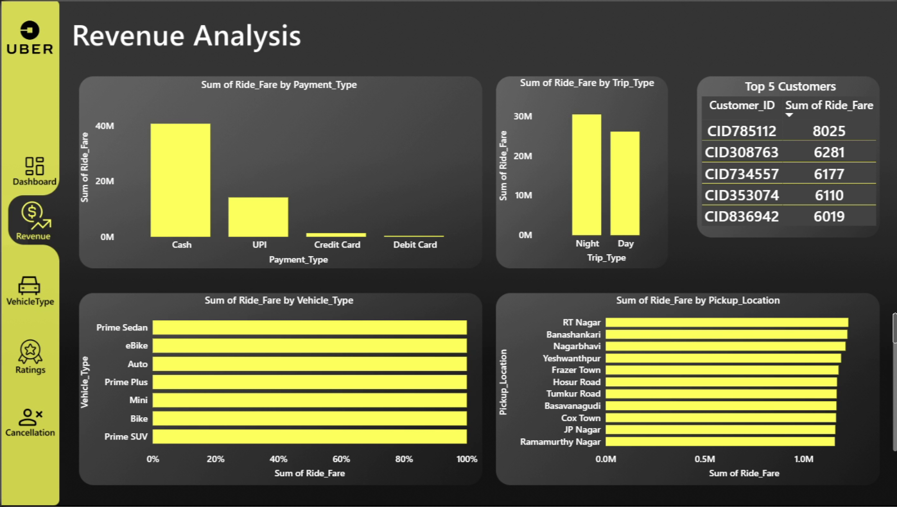
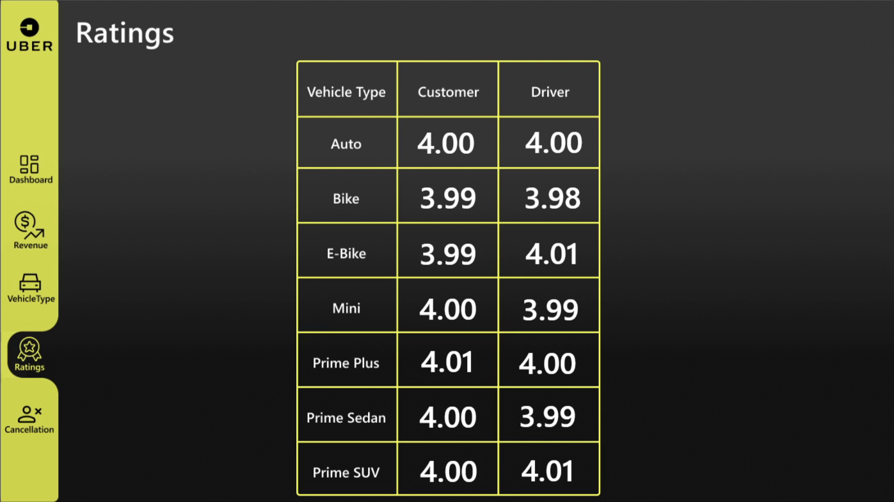
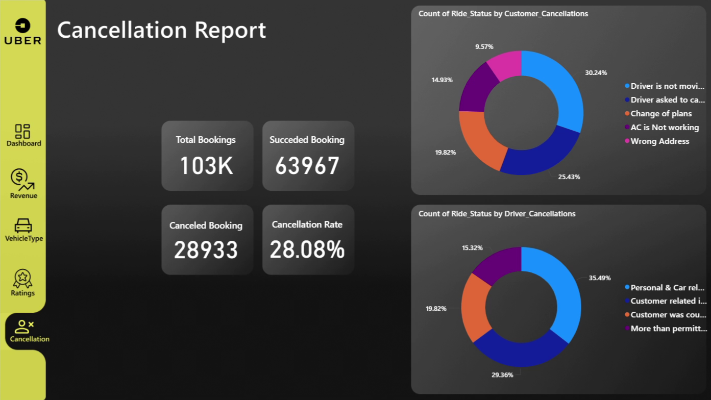

# Uber Trip Analysis Project

🚖 Dive into the Uber trip data! This project explores **ride patterns, vehicle performance, cancellations, customer behavior, and revenue trends**, uncovering key insights to improve operations and business decisions.


---

## Background

This project was designed to analyze Uber trip data to understand:

- How different **vehicle types perform** in terms of distance and revenue  
- **Customer satisfaction** through ratings  
- **Ride cancellations** from customers and drivers  
- **Payment method adoption**, e.g., UPI usage  
- **Operational performance** to identify inefficiencies  

The insights also serve as the foundation for **Power BI dashboards**, where trends, patterns, and KPIs can be visualized dynamically.

### Questions answered through SQL and Power BI

1. How many rides were successfully completed?  
2. What is the **average distance per vehicle type**?  
3. How many rides were cancelled by customers or drivers?  
4. Who are the top customers by ride count?  
5. What are the **max/min driver ratings** per vehicle type?  
6. How do customers rate different vehicle types?  
7. What is the **total revenue** from completed rides?  
8. Which rides used **UPI payments**?  
9. What are the reasons for **incomplete rides**?  

🔍 SQL queries? Check them out here: [project sql folder](/Sql/Sql_Querries.sql/)
---

## Tools I Used

- **SQL:** Core for querying Uber trip data  
- **PostgreSQL:** Database management system for handling datasets  
- **Visual Studio Code:** Writing and executing SQL scripts  
- **Power BI:** For building interactive dashboards and visualizing insights  
- **Git & GitHub:** Version control and project sharing  

---

## The Analysis

Each SQL query was designed to extract meaningful insights from Uber trip data.

### 1. Successful Rides

```sql
SELECT * 
FROM Trip_Details
WHERE Ride_Status = 'Success';
```
Provides details of successfully completed trips.
Helps track business success rate.
Insight: Completed rides reflect operational efficiency and customer engagement.

### 2. Average Ride Distance per Vehicle Type

```sql
SELECT 
    Vehicle_Type, 
    ROUND(AVG(Distance_km), 2)::text || ' km' AS avg_distance
FROM Trip_Details
GROUP BY Vehicle_Type;
```
Shows which vehicles are preferred for longer or shorter trips.
Insight: Sedans and SUVs usually cover longer distances; Bikes and Autos mostly handle short city rides.

### 3. Customer Cancellations
```sql
SELECT COUNT(*) AS cancelled_by_customers
FROM Trip_Details
WHERE Ride_Status = 'Cancelled by Customer';
```
Helps understand customer behavior and dissatisfaction patterns.
Insight: High cancellations may indicate pricing issues, delays, or user experience problems.

### 4. Top 5 Customers by Ride Count

```sql
SELECT Customer_ID, COUNT(Ride_ID) AS total_rides
FROM Trip_Details
GROUP BY Customer_ID
ORDER BY total_rides DESC
LIMIT 5;
```

Identifies the most loyal/high-value customers.
Insight: Top customers can be targeted with loyalty rewards or premium offers.

### 5.Driver Cancellations

```sql
SELECT COUNT(*) AS cancelled_by_driver
FROM Trip_Details
WHERE Driver_Cancellations = 'Personal & Car related issue';
```

Highlights operational inefficiencies due to driver issues.
Insight: Monitoring driver cancellations helps optimize driver management.


# Power BI Analysis (DAX Measures)

This section summarizes the **Power BI measures** used in the Uber project, along with their **DAX formulas** and purpose.

---

## Revenue & Booking Measures

| Measure | DAX Formula | Purpose |
|---------|-------------|---------|
| **TotalBookings** | `TotalBookings = COUNTROWS('Trip_Details')` | Total number of rides/bookings. |
| **Total_Trips** | `Total_Trips = COUNTROWS('Trip_Details')` | Alias for total rides. |
| **Total_Booking_Amount** | `Total_Booking_Amount = SUM('Trip_Details'[Ride_Fare])` | Total revenue from all trips. |
| **Avg_Booking_Amount** | `Avg_Booking_Amount = AVERAGE('Trip_Details'[Ride_Fare])` | Average fare per ride. |

---

## Distance Measures

| Measure | DAX Formula | Purpose |
|---------|-------------|---------|
| **Total_Trip_Distance** | `Total_Trip_Distance = SUM('Trip_Details'[Distance_km])` | Total km traveled across all trips. |
| **Total_Trip_Distance_Display** | `Total_Trip_Distance_Display = FORMAT([Total_Trip_Distance], "#,##0") & " km"` | Formatted total distance for dashboard display. |
| **Avg_Trip_Distance** | `Avg_Trip_Distance = AVERAGE('Trip_Details'[Distance_km])` | Average distance per trip. |

---

## Trip Duration & Type

| Measure | DAX Formula | Purpose |
|---------|-------------|---------|
| **Avg_Trip_Time_Display** | `Avg_Trip_Time_Display = AVERAGE('Trip_Details'[Trip_Time_Minutes])` | Average trip duration in minutes. |
| **Trip_Type** | `Trip_Type = SELECTEDVALUE('Trip_Details'[Vehicle_Type])` | Displays the vehicle type selected in slicers/filters. |

---

## Cancellation Measures

| Measure | DAX Formula | Purpose |
|---------|-------------|---------|
| **CancledBookings** | `CancledBookings = CALCULATE(COUNTROWS('Trip_Details'), 'Trip_Details'[Ride_Status] = "Cancelled by Customer")` | Number of rides cancelled by customers. |
| **CancelledPercentage** | `CancelledPercentage = DIVIDE([CancledBookings], [TotalBookings], 0) * 100` | Percentage of rides cancelled. |

---

## Customer Behavior & Locations

| Measure | DAX Formula | Purpose |
|---------|-------------|---------|
| **Most_Frequent_Pickup** | `Most_Frequent_Pickup = TOPN(1, SUMMARIZE('Trip_Details', 'Trip_Details'[Pickup_Location], "Trips", COUNTROWS('Trip_Details')), [Trips], DESC)` | Most common pickup location. |
| **Most_Frequent_Drop** | `Most_Frequent_Drop = TOPN(1, SUMMARIZE('Trip_Details', 'Trip_Details'[Drop_Location], "Trips", COUNTROWS('Trip_Details')), [Trips], DESC)` | Most common drop location. |
| **Farthest_Trip** | `Farthest_Trip = MAX('Trip_Details'[Distance_km])` | Longest trip distance in the dataset. |


## 📊 Dashboard Summaries & Key Insights

### 1. Main Dashboard: At a Glance
The main overview dashboard provides a high-level summary of the key business metrics for the month.

* **Total Trips:** **103,000** bookings were made.
* **Total Revenue:** The total booking amount was **₹57 Million**.
* **Averages:** The average booking amount was **₹549**, with an average trip distance of **14 km**.
* **Key Corridor:** The most frequent travel route is from **Banashankari** (top pickup) to **Peenya** (top drop-off).
* **Busiest Hubs:** **Banashankari**, **Yeshwanthpur**, and **RT Nagar** are the top 3 pickup locations.




### 2. Revenue Analysis
This view breaks down the sources of revenue, identifying top customers and high-performing categories.

* **Payment Dominance:** **Cash** is the primary payment method, contributing over **₹40 Million** in ride fare, significantly more than UPI. Credit and Debit cards are minimally used.
* **Revenue by Time:** **Night** trips generate slightly more revenue than day trips.
* **Top Customers:** A small group of power users contributes significantly to revenue. The top customer (**CID785112**) alone accounted for over 8,000 in ride fare.
* **Top Earning Vehicle:** **Prime Sedan** is the highest revenue-generating vehicle type.
* **Top Earning Location:** **RT Nagar** is the pickup location that generates the most revenue.



### 3. Vehicle Analysis
This dashboard details the usage patterns and distribution of different vehicle types in the fleet.

* **Even Fleet Distribution:** The fleet is remarkably balanced, with each vehicle type (Sedan, Bike, Auto, etc.) accounting for an almost equal share (**~14%**) of total rides.
* **Ride Count:** **Prime Sedan** completed the most rides (**9,379**), while **Prime SUV** completed the fewest (**8,996**).
* **Distance Anomaly:** **Autos** are used for shorter trips, with an average distance of **10 km**. All other vehicle types have a consistent average trip distance of **25 km**.
* **Highest Revenue per Vehicle:** **Prime Sedan** generated the highest total trip amount at **₹5.22 Million**.


### 4. Ratings Analysis
This report provides a simple but crucial look at customer satisfaction and driver performance.

* **Highly Consistent Ratings:** Both customer and driver ratings are exceptionally stable across all vehicle types, hovering between **3.98** and **4.01**.
* **Peak Satisfaction:** **Prime Plus** received the highest average customer rating (**4.01**).
* **Top Driver Performance:** Drivers of **E-Bikes** and **Prime SUVs** received the highest average rating (**4.01**).
* **Overall Quality:** The tight range of high scores indicates a consistent and positive service experience regardless of the vehicle chosen.



### 5. Cancellation Report
This dashboard sheds light on why trips fail, providing critical feedback for service improvement.

* **Overall Cancellation Rate:** A significant **28.08%** of all bookings were canceled, totaling **28,933** canceled trips.
* **Top Customer Cancellation Reasons:**
    1.  **Driver is not moving** (30%)
    2.  **Driver asked to cancel** (25%)
* **Top Driver Cancellation Reasons:**
    1.  **Personal & Car related issues** (35%)
    2.  **Customer related issues** (29%)
* **Key Insight:** The top two reasons for customer cancellations are related to driver behavior or issues, suggesting that improving driver reliability and communication could significantly reduce the cancellation rate.



---

## 🏁 Conclusion & Takeaways
This deep dive into Uber's July 2024 data reveals a stable operation with clear patterns. While ratings are consistently high and the vehicle fleet is well-balanced, the high cancellation rate—driven primarily by driver-related issues—presents a major opportunity for improvement. Revenue is heavily reliant on cash payments and a core group of loyal customers. Focusing on reducing cancellations and encouraging digital payments could further boost efficiency and profitability.